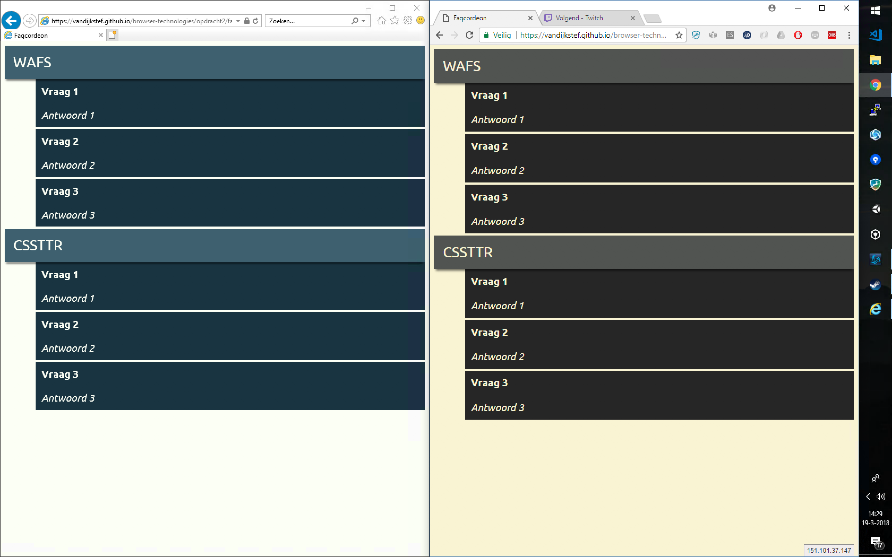

# Faqcordeon

## Sketches
This image shows a fully collapsed (JS and/or new CSS available). The second sketch is half collapsed version.

This image shows the fully uncollapsed FAQ. Note, the arrows show interaction and should only be visible when that interaction is possible


## Techniques and notes
### CSS Variables
CSS variables are used for the colors. For clarity, I'm using another color scheme when they are not supported.
To safely use CSS variables, you should use a cascading fallback. Older browsers will use **red**, newer browsers, supporting CSS variables will use **blue**. If a variable is undefined, and variables are supported, in this case, **green** will be used.

``` CSS
:root {
	--foo: blue;
}

* {
	color: red;
	color: var(--foo);
	color: var(--undefined, green)
}
```

This image shows the fallback. Left IE without CSS variable support, right Chrome with CSS variable support. Note: The used colors are different on purpose.


### JS Folding
Upon loading the page, I will add a class to the outer element (ul), so style rules can make the whole thing collapse.